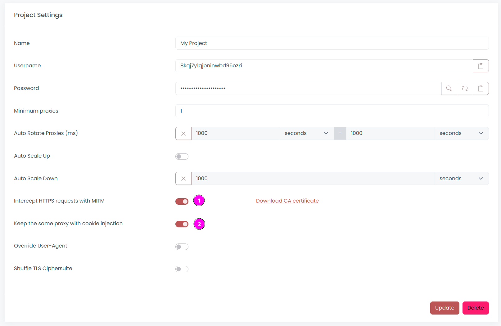

# Fabien's WebScraping Anti-Ban Workshop


## Introduction

Our goal is to understand how anti-bot protections work and how to bypass them.

I created a dedicated website for this workshop [https://trekky-reviews.com](https://trekky-reviews.com).
This website provides a list of hotels for every city, including reviews.

We will collect **name, email and reviews** for each hotel.

During this workshop, we will use the following open-source software:

| Framework                            | Description                                                                  |
|--------------------------------------|------------------------------------------------------------------------------|
| [Scrapy](https://scrapy.org)         | the leading framework for web scraping                                       |
| [Scrapoxy](https://scrapoxy.io)      | the super proxies aggregator                                                 |
| [Playwright](https://playwright.dev) | the latest headless browser framework that integrates seamlessly with Scrapy |
| [Babel.js](https://babeljs.io)       | a transpiler used for deobfuscation purposes                                 |

The scraper can be found at [scrapers/spiders/trekky.py](scrapers/spiders/trekky.py).

All solutions are located in [solutions](solutions).
If you have any difficulties implementing a solution, feel free to copy and paste it. 
However, I recommend taking some time to search and explore to get the most out of the workshop, rather than rushing through it in 10 minutes.


## Preflight Checklist

### VirtualBox (Linux and Windows)

To simplify the installation process,
I've pre-configured an Ubuntu virtual machine for you with
all the necessary dependencies for this workshop.

<table>
    <tr>
        <td>
            
        </td>
        <td>
This virtual machine is compatible only with AMD64 architecture (Linux, Windows, and Intel-based macOS).
            
For macOS M1 (ARM64), please manually install the dependencies. 

On Windows, avoid using WSL2 (it doesn't work with Playwright)
        </td>
    </tr>
</table>

You can download it **[from this link](https://bit.ly/scwsfiles).**

The virtual machine is in OVA format and can be easily imported into [VirtualBox](https://www.virtualbox.org).

It requires 8 Go RAM and 2 vCPU.

Click on `Import Appliance` and choose the OVA file you downloaded.

Credentials are: `vboxguest / changeme`.

I recommend switching the network setting from NAT to **Bridge Adapter** for improved performance.

_Note: If the network is too slow, I have USB drives available with the VM._


### Full Installation (Linux, Windows, and macOS)

You can manually install the required dependencies, which include:

- Python (version 3 or higher) with virtualenv
- Node.js (version 20 or higher)
- Docker

#### Python

If you need Python, I recommend using [Anaconda](https://www.anaconda.com/download).

To install a Virtual Environment, run the following command:

```shell
python3 -v venv venv
source venv/bin/activate
```


#### Node.js

To install Node.js, follow the instructions on: https://nodejs.org/en/download


#### Docker

To install Docker, follow the instructions for
[Mac](https://docs.docker.com/desktop/install/mac-install), 
[Windows](https://docs.docker.com/desktop/install/windows-install) or
[Linux](https://docs.docker.com/desktop/install/linux/).


## Setting up

This step is necessary even if you are using the VM.


### Step 1: Clone the Repository

Clone this repository:

```shell
git clone https://github.com/fabienvauchelles/scraping-workshop.git
cd scraping-workshop
```


### Step 2: Install Python libraries

Open a shell and install libraries:

```shell
pip install -r requirements.txt
```


### Step 3: Install Playwright

After installing the Python libraries, run the follow command:

```shell
playwright install --with-deps chromium
```


### Step 4: Install Node.js

Install Node.js from the [official website](https://nodejs.org/en/download/) or through the version management [NVM](https://github.com/nvm-sh/nvm)


### Step 5: Install Node.js libraries

Open a shell and install libraries from `package.json`:

```shell
npm install
```


### Step 6: Scrapoxy

Run the following command to download Scrapoxy:

```shell
sudo docker pull fabienvauchelles/scrapoxy
```


## Challenge 1: Run your first Scraper

The URL to scrape is: [https://trekky-reviews.com/level1](https://trekky-reviews.com/level1)

Our goal is to collect **names, emails, and reviews** for each hotel listed.

Open the file [`scrapers/spiders/trekky.py`](scrapers/spiders/trekky.py).

In Scrapy, a spider is a Python class with a unique `name` property. Here, the name is `trekky`.

The spider class includes a method called `start_requests`, which defines the initial URLs to scrape. 
When a URL is fetched, the Scrapy engine triggers a callback function. 
This callback function handles the parsing of the data. 
It's also possible to generate new requests from within the callback function, allowing for chaining of requests and callbacks.

The structure of items is defined in the file [`scrapers/items.py`](scrapers/items.py). 
Each item type is represented by a dataclass containing fields and a loader:

* `HotelItem`: name, email, review with the loader `HotelItemLoader`
* `ReviewItem`: rating with the loader `ReviewItemLoader`

To run the spider, open a terminal at the project's root directory and run the following command:

```shell
scrapy crawl trekky
```

Scrapy will collect data from **50 hotels**:

```text
2024-07-05 23:11:43 [trekky] INFO: 

We got: 50 items

```

Check the `results.csv` file to confirm that all items were collected.


## Challenge 2: First Anti-Bot protection

The URL to scrape is: [https://trekky-reviews.com/level2](https://trekky-reviews.com/level2)

Update the URL in your scraper to target the new page and execute the spider:

```shell
scrapy crawl trekky
```

Data collection may fail due to **an anti-bot system**.

Pay attention to the **messages** explaining why access is blocked and use this information to correct the scraper.

_Hint: It relates to HTTP request headers 😉_

<details>
    <summary>Soluce is here</summary>
    <a href="solutions/challenge-2.py">Open the soluce</a>
</details>


## Challenge 3: Rate limit

The URL to scrape is: [https://trekky-reviews.com/level4](https://trekky-reviews.com/level4) (we will skip level3)

Update the URL in your scraper to target the new page and execute the spider:

```shell
scrapy crawl trekky
```

Data collection might fail due to **rate limiting** on our IP address.

<table>
    <tr>
        <td>
            
        </td>
        <td>
            Please don't adjust the delay between requests or the number of concurrent requests; <b>that is not our goal</b>. 
            Imagine we need to collect millions of items within a few hours, and delaying our scraping session is not an option. 
            Instead, we will use proxies to distribute requests across multiple IP addresses.
        </td>
    </tr>
</table>

Use [Scrapoxy](https://scrapoxy.io) to bypass the rate limit with a cloud provider (not a proxy service).


### Step 1: Install Scrapoxy

Follow this [guide](https://scrapoxy.io/intro/get-started) or run the following command in the project directory:

```shell
sudo docker run -p 8888:8888 -p 8890:8890 -e AUTH_LOCAL_USERNAME=admin -e AUTH_LOCAL_PASSWORD=password -e BACKEND_JWT_SECRET=secret1 -e FRONTEND_JWT_SECRET=secret2 -e STORAGE_FILE_FILENAME=/scrapoxy.json -v ./scrapoxy.json:/scrapoxy.json fabienvauchelles/scrapoxy:latest
```


### Step 2: Create a new project

In the new project, deactivate `Intercept HTTPS requests with MITM`:


### Step 3: Add a Proxy Provider

See the slides of the provider name and credentials.

Use **5 proxies** from **a European** region.


If you don't have an account with these cloud providers, you can create one.

<table>
    <tr>
        <td width="70">
            
        </td>
        <td>
            They typically require a credit card, and you may need to pay a nominal fee of $1 or $2 for this workshop.
            Such charges are common when using proxies. Don't worry; in the next challenge, I'll provide you with free credit.
        </td>
    </tr>
</table>


### Step 4: Run the connector


### Step 5: Connect Scrapoxy to the spider

Follow this [guide](https://scrapoxy.io/integration/python/scrapy/guide).


### Step 6: Execute the spider

Run your spider and check that Scrapoxy is handling the requests:


You should observe an increase in the count of received and sent requests.

<details>
    <summary>Soluce is here</summary>
    <a href="solutions/challenge-3.py">Open the soluce</a>
</details>


## Challenge 4: Fingerprint

The URL to scrape is: [https://trekky-reviews.com/level6](https://trekky-reviews.com/level6) (we will skip level5).

Update the URL in your scraper to target the new page and execute the spider:

```shell
scrapy crawl trekky
```

Data collection may fail due to **fingerprinting**.

Use the Network Inspector in your browser to view all requests. 
You will notice a new request appearing, which is a **POST request** instead of a GET request.


Inspect the website's code to identify the **JavaScript** that triggers this request.


It's clear that we need to **execute JavaScript**. 
Simply using Scrapy to send HTTP requests is not enough.

Also, it's important to maintain the **same IP address** throughout the session. 
Scrapoxy offers a **sticky session** feature for this purpose when using a browser.

Navigate to the Project options and enable both `Intercept HTTPS requests with MITM` 
and `Keep the same proxy with cookie injection`:



We will use the headless framework [Playwright](https://playwright.dev) along with Scrapy's plugin [scrapy-playwright](https://github.com/scrapy-plugins/scrapy-playwright).

<table>
    <tr>
        <td width="70">
            
        </td>
        <td>
            <a href="https://github.com/scrapy-plugins/scrapy-playwright">scrapy-playwright</a> should already be installed.
        </td>
    </tr>
</table>

Our goal is to adapt the spider to integrate Playwright.

You can now completely replace the code in [solutions/challenge-4.py](solutions/challenge-4.py)
due to extensive modifications needed. 

The updates include:
 
* **Settings**: Updated to add a custom `DOWNLOAD_HANDLERS`.
* **Playwright Configuration**: `PLAYWRIGHT_LAUNCH_OPTIONS` now:
  * Disables headless mode, allowing you to view Playwright’s actions.
  * Configures a proxy to route traffic through Scrapoxy.
* **Request Metadata**: Each request now includes metadata to enable Playwright and ignore HTTPS errors (using ignore_https_errors).


## Challenge 5: Consistency

The URL to scrape is: [https://trekky-reviews.com/level7](https://trekky-reviews.com/level7)

Update the URL in your scraper to target the new page and execute the spider:

```shell
scrapy crawl trekky
```

You will notice that data collection may fail due to **inconsistency** errors.

Anti-bot checks consistency across various layers of the browser stack.

Try to solve these errors!

_Hint: It involves adjusting timezones 😉_

<details>
    <summary>Soluce is here</summary>
    <a href="solutions/challenge-5.py">Open the soluce</a>
</details>


## Challenge 6: Deobfuscation

The URL to scrape is: [https://trekky-reviews.com/level8](https://trekky-reviews.com/level8)

Update the URL in your scraper to target the new page and execute the spider:

```shell
scrapy crawl trekky
```

### Step 1: Find the Anti-Bot Javascript

Use the **Network Inspector** to review all requests.
Among them, you'll spot some unusual ones. 
By inspecting the payload, you'll notice that the content is **encrypted**:


Inspect the website's code to find the JavaScript responsible for sending this requests.
In this case, the source code is obfuscated.

Obfuscated code appears to be:

```javascript
var _qkrt1f=window,_uqvmii="tdN",_u5zh1i="UNM",_p949z3="on",_eu2jji="en",_vnsd5q="bto",_bi4e9="a",_f1e79r="e",_w13dld="ode",_vbg0l7="RSA-",_6uh486="ki"...
```

To understand which information is being sent and how to emulate it, we need to **deobfuscate the code**.


### Step 2: Understand the code structure

To understand the structure of the code, copy/paste some code into the website [AST Explorer](https://astexplorer.net)

Don't forget to select `@babel/parser` and enable `Transform`:


AST Explorer parses the source code and generates a visual tree:


<table>
    <tr>
        <td width="70">
            <image src="images/info.png">
        </td>
        <td>
            For the record, I only obfuscated strings, not the code flow.
        </td>
    </tr>
</table>


### Step 3: Deobfuscate the Javascript

Copy/paste the whole obfuscated code to `tools/obfuscated.js`.

And run the deobfucator script:

```shell
node tools/deobfuscator.js
```

This script will deobfuscate specificaly this code.

<table>
    <tr>
        <td width="70">
            <image src="images/note.png">
        </td>
        <td>
            You can use <a href="https://obf-io.deobfuscate.io">online tools</a> to deobfuscate this script,
given that it's a straightforward obfuscated script.
            Also, <a href="https://github.com/features/copilot">GitHub Copilot</a>
            can be incredibly helpful in writing AST operations, just as
            <a href="https://claude.ai">Claude Sonnet 3.5</a>
            is valuable for deciphering complex functions.
        </td>
    </tr>
</table>


### Step 4: Payload generation

Here’s a summary of the script’s behavior:

1. It collects **WebGL information**;
2. It encrypts the data using **RSA encryption** with an obfuscated public key;
3. It sends the payload to the webserver via a **POST request**.

We need to implement the same approach in our spider.

Since we will be crafting the payload ourselves, there is **no need** to use Playwright anymore. 
We will simply send the payload **before** initiating any requests.

You can now completely replace the code in [solutions/challenge-6-1-partial.py](solutions/challenge-6-1-partial.py)
and fill in the missing parts.


## Conclusion

Thank you so much for participating in this workshop.

Your feedback is incredibly valuable to me. 
Please take a moment to complete this survey; your insights will greatly assist in enhancing future workshops:

👉 [GO TO SURVEY](https://bit.ly/scwsv) 👈


## Licence

WebScraping Anti-Ban Workshop © 2024 by [Fabien Vauchelles](https://www.linkedin.com/in/fabienvauchelles) is licensed under [CC BY-NC-ND 4.0](https://creativecommons.org/licenses/by-nc-nd/4.0/?ref=chooser-v1):

* Credit must be given to the creator;
* Only noncommercial use of your work is permitted;
* No derivatives or adaptations of your work are permitted.

